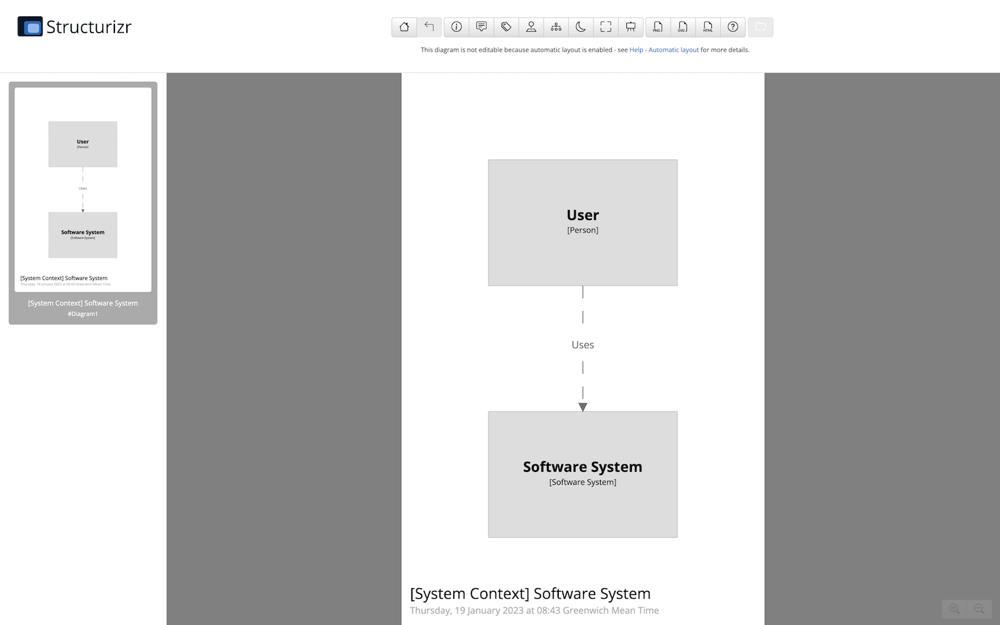

## Getting started

Here's a quick getting started to using Structurizr Lite via the pre-built Docker image,
and assumes that you have Docker installed.

### Create a directory

First you need to create a directory somewhere to store your workspace.
We'll refer to this directory as the "Structurizr data directory".

### Start Structurizr Lite

You can now start Structurizr Lite with the following commands, replacing `PATH` with the path to your Structurizr data directory:

```
docker pull structurizr/lite
docker run -it --rm -p 8080:8080 -v PATH:/usr/local/structurizr structurizr/lite
```

For example, if your Structurizr data directory is located at `/Users/simon/structurizr`, the command would be:

```
docker pull structurizr/lite
docker run -it --rm -p 8080:8080 -v /Users/simon/structurizr:/usr/local/structurizr structurizr/lite
```

### Open your web browser

With Structurizr Lite running, you can head to [http://localhost:8080](http://localhost:8080) in your web browser, where
you should see the diagram editor:



At startup, Structurizr Lite created a file named `workspace.dsl` in your Structurizr data directory as a starting point.
This is a Structurizr workspace, defined using the [Structurizr DSL](https://github.com/structurizr/dsl).
It defines a model consisting of a user using a software system, and a single C4 model system context view.

### Make some changes

You can now modify the `workspace.dsl` file, save the changes, and refresh your web browser to see those changes.
Some useful links related to the DSL are:

- [Structurizr DSL language reference](https://github.com/structurizr/dsl/blob/master/docs/language-reference.md)
- [Structurizr DSL cookbook](https://github.com/structurizr/dsl/tree/master/docs/cookbook)
